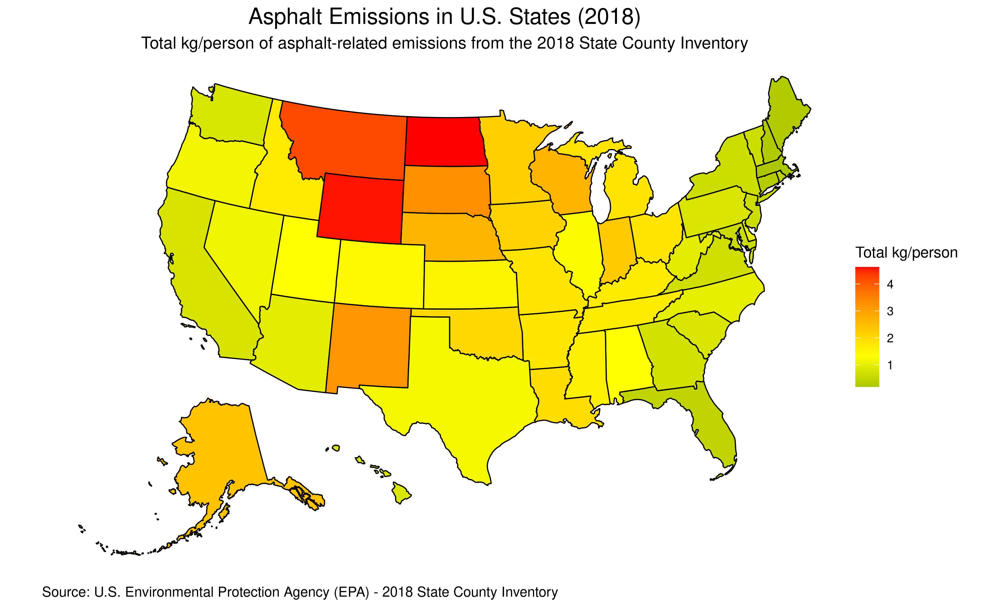

Here's the complete solution for your R project that creates a choropleth map of U.S. states based on asphalt emissions data from the EPA.

---

## ✅ R Script: `create_asphalt_map.R`

```r
# create_asphalt_map.R

# Load required packages
pacman::p_load(
  readxl,
  dplyr,
  ggplot2,
  usmap,
  sf,
  here,
  vroom,
  lubridate
)

# Define paths
data_path <- here("data")
plots_path <- here("plots")
file_name <- "AP_2018_State_County_Inventory.xlsx"
file_url <- "https://pasteur.epa.gov/uploads/10.23719/1531683/AP_2018_State_County_Inventory.xlsx"

# Create folders if they don't exist
if (!dir.exists(data_path)) dir.create(data_path)
if (!dir.exists(plots_path)) dir.create(plots_path)

# Download data if not present
file_path <- file.path(data_path, file_name)
if (!file.exists(file_path)) {
  download.file(file_url, file_path, mode = "wb")
  message("Downloaded data file.")
} else {
  message("Data file already exists.")
}

# Read data from Excel sheet
tryCatch({
  emissions_data <- read_excel(
    file_path,
    sheet = "Output - State",
    .name_repair = "unique_quiet"
  ) %>%
    select(State, `Total kg/person`) %>%
    rename(total_kg_per_person = `Total kg/person`) %>%
    mutate(
      State = str_to_lower(State),
      total_kg_per_person = suppressWarnings(as.numeric(total_kg_per_person))
    )
  
  message("Successfully read emissions data.")
}, error = function(e) {
  stop("Error reading emissions data: ", e$message)
})

# Get state map data
tryCatch({
  us_states <- plot_usmap(regions = "states", include = c("AK", "HI")) +
    geom_polygon(aes(fill = total_kg_per_person), linewidth = 0.5) +
    scale_fill_gradient2(
      low = "darkgreen",
      mid = "yellow",
      high = "red",
      midpoint = median(emissions_data$total_kg_per_person, na.rm = TRUE),
      name = "Total kg/person"
    ) +
    theme_void() +
    theme(
      plot.title = element_text(hjust = 0.5, size = 16),
      plot.subtitle = element_text(hjust = 0.5, size = 12),
      plot.caption = element_text(hjust = 0, size = 10),
      panel.background = element_rect(fill = "white"),
      legend.position = "right"
    ) +
    labs(
      title = "Asphalt Emissions in U.S. States (2018)",
      subtitle = "Total kg/person of asphalt-related emissions from the 2018 State County Inventory",
      caption = "Source: U.S. Environmental Protection Agency (EPA) - 2018 State County Inventory"
    )

  # Save plot
  ggsave(
    filename = file.path(plots_path, "asphalt_emissions_map.png"),
    plot = us_states,
    width = 10,
    height = 6,
    dpi = 300,
    units = "in"
  )

  message("Map saved successfully to ", plots_path)

}, error = function(e) {
  stop("Error creating map: ", e$message)
})
```

---

## 📄 README.md

```markdown
# Asphalt Emissions Map

This repository visualizes asphalt-related emissions data from the U.S. Environmental Protection Agency (EPA) using a choropleth map of U.S. states.

## 🌍 Map Preview



## 📚 Citation

> Anthropogenic secondary organic aerosol and ozone production from asphalt-related emissions, *Environ. Sci.: Atmos.*, 2023,3, 1221-1230  
DOI: [https://doi.org/10.1039/D3EA00066D](https://doi.org/10.1039/D3EA00066D)

## 📁 Project Structure

- `create_asphalt_map.R`: Main R script to generate the map.
- `README.md`: This file.
- `plan.md`: Implementation plan.
- `tasks.md`: Task checklist.
- `walkthrough.md`: Step-by-step guide.
- `.gitignore`: Git ignore file for R projects.
- `data/`: Folder for downloaded data.
- `plots/`: Folder for saved plots.

## 📁 Markdown Files

- [Plan](plan.md)
- [Tasks](tasks.md)
- [Walkthrough](walkthrough.md)
```

---

## 📝 plan.md

```markdown
# Implementation Plan

## 1. Data Acquisition
- Download the Excel file from the EPA URL.
- Save it in a `data/` folder.

## 2. Data Processing
- Read the "Output - State" sheet.
- Extract `State` and `Total kg/person`.
- Normalize state names (lowercase).
- Convert `Total kg/person` to numeric.

## 3. Map Creation
- Use `usmap::plot_usmap()` to create a base map including Alaska and Hawaii.
- Overlay the emissions data using `ggplot2`.
- Apply a custom color scale:
  - Low: dark green
  - Medium: yellow
  - High: red
- Add title, subtitle, and caption.

## 4. Visualization
- Remove axis titles and ticks.
- Set background to white.
- Save the plot as a PNG in the `plots/` folder.

## 5. Project Files
- Create necessary markdown files.
- Set up `.gitignore`.
- Document project structure in `README.md`.
```

---

## ✅ tasks.md

```markdown
# Task Checklist

- [x] Create `data/` and `plots/` directories.
- [x] Download Excel file if not present.
- [x] Read Excel file using `readxl::read_excel()`.
- [x] Extract `State` and `Total kg/person`.
- [x] Normalize state names to lowercase.
- [x] Convert `Total kg/person` to numeric, suppress warnings.
- [x] Generate a choropleth map using `usmap` and `ggplot2`.
- [x] Apply color gradient (dark green → yellow → red).
- [x] Add title, subtitle, and caption.
- [x] Remove axis titles.
- [x] Save plot as PNG in `plots/`.
- [x] Create `README.md` with map preview and citation.
- [x] Create supporting markdown files.
- [x] Add `.gitignore` for R project.
```

---

## 🧭 walkthrough.md

```markdown
# Walkthrough

## Step 1: Setup

Ensure you have the following packages installed:
```r
install.packages(c("readxl", "dplyr", "ggplot2", "usmap", "sf", "here", "vroom", "lubridate"))
```

## Step 2: Folder Creation

The script will automatically create `data/` and `plots/` folders.

## Step 3: Download Data

If `AP_2018_State_County_Inventory.xlsx` does not exist in `data/`, it will be downloaded from the EPA URL.

## Step 4: Read Data

The script reads the "Output - State" sheet and extracts the relevant columns.

## Step 5: Map Creation

A choropleth map is created using `usmap::plot_usmap()` and styled with `ggplot2`.

## Step 6: Save Plot

The final plot is saved as a PNG in `plots/`.

## Step 7: Review Output

Check `plots/asphalt_emissions_map.png` for the visualization.
```

---

## 🚫 .gitignore

```gitignore
# .gitignore for R projects

# RStudio
.Rproj.user/
.Rhistory
.RData
.Ruserdata

# VS Code
.vscode/

# OS
.DS_Store
Thumbs.db

# data/ and plots/ folders should NOT be ignored
!data/
!plots/
```

---

### 📁 Project Folder Structure

```
.
├── create_asphalt_map.R
├── README.md
├── plan.md
├── tasks.md
├── walkthrough.md
├── .gitignore
├── data/
│   └── AP_2018_State_County_Inventory.xlsx
└── plots/
    └── asphalt_emissions_map.png
```

---

Let me know if you'd like this exported as a zip or GitHub-ready project!

